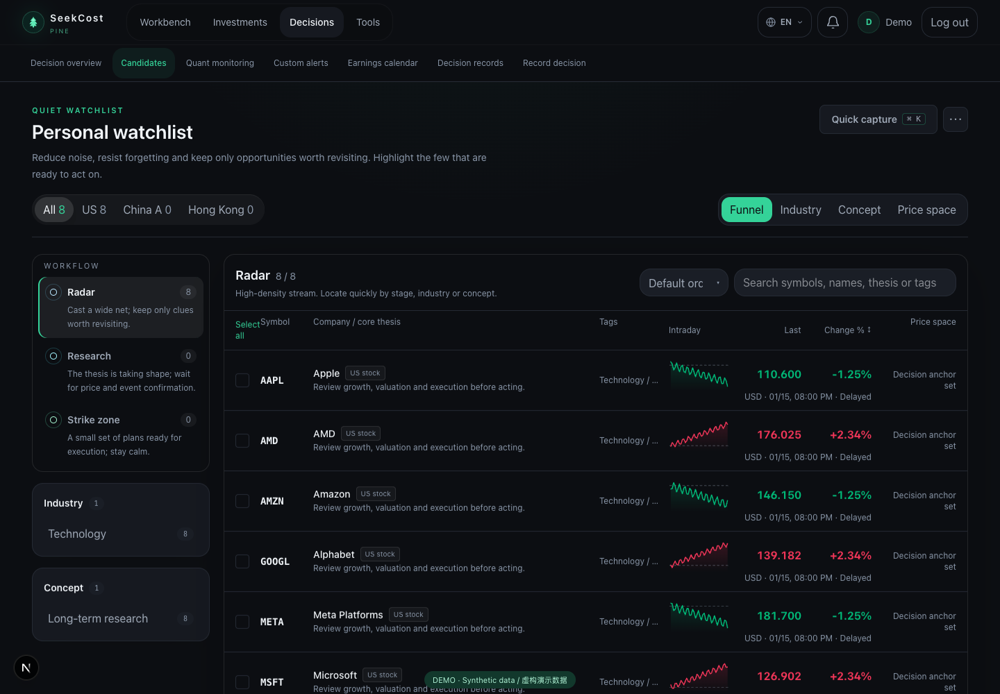
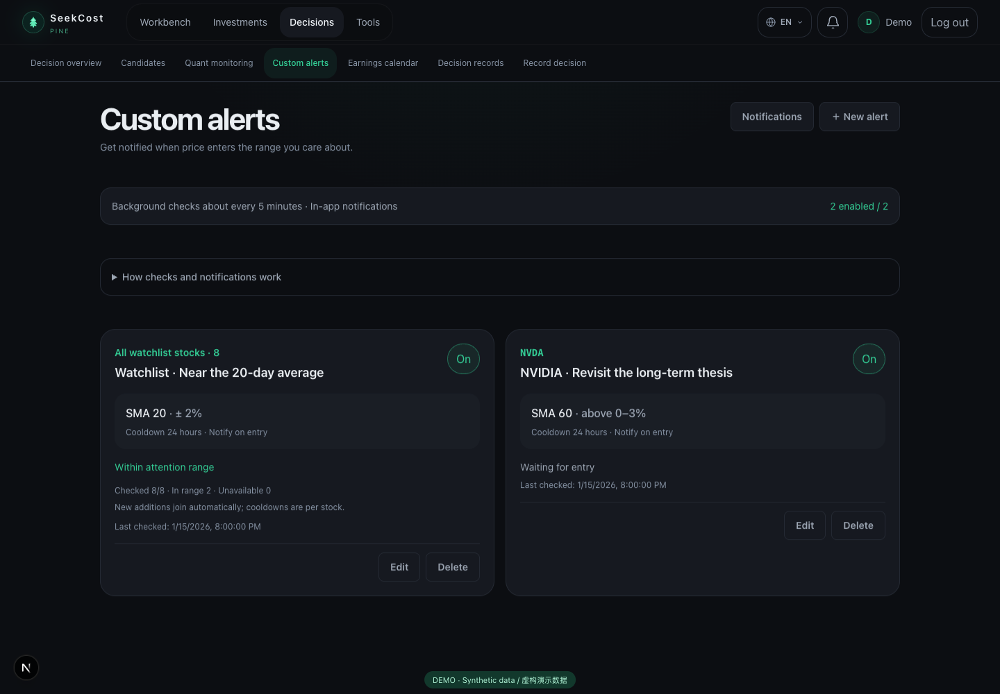
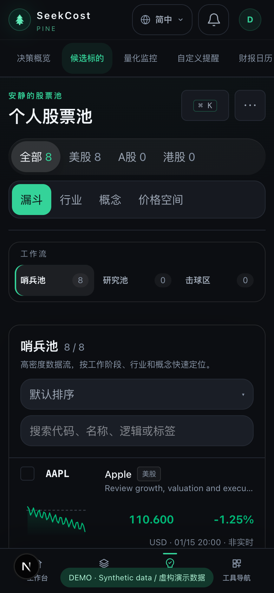

# SeekCost

[English](README.md) | [简体中文](README_CN.md)

**Your research. Your decisions. Your data.**

SeekCost is an MIT-licensed, self-hosted personal investment workbench. Run it on your own server and keep watchlists, research, price observations, alerts, and decision records together—without handing your investment history to a hosted platform.

[Run locally with Conda](#quick-start-with-conda-and-sqlite) · [Self-hosting](docs/SELF_HOSTING.md) · [Backup & recovery](docs/BACKUP.md) · [Security](SECURITY.md) · [MIT license](LICENSE)



> Screenshots show the real application with fictional API fixtures, not real holdings or live market quotes. The project is actively evolving. Container deployment and disaster recovery must be verified on your own test host before storing your only copy of important data.

It is organized around one explicit feedback loop:

**Understand a company → make a decision → track holding cost → review the outcome**

The primary cost workspace focuses on open market holdings and the costs currently recorded for them. Legacy records for deposits, physical assets, personal finance and capability spending remain in the database and their existing pages still work, but they are no longer promoted in the main cost workflow. SeekCost does not try to replace a market-data terminal or brokerage app. It has no public feed, follower graph, popularity ranking, or automatic publishing. Investment, decision, and transaction data remain private to the current user.

## Self-host in a few steps

With Docker Compose v2 and Python 3 installed, run from the repository root:

```bash
python3 scripts/selfhost-init.py
docker compose config --quiet
docker compose up -d --build
# After the backend becomes healthy; password is entered interactively:
docker compose exec backend python -m app.core.owner myowner
```

Open `http://localhost:3000`. Remote installs can use an SSH tunnel or an HTTPS reverse proxy. The [self-hosting guide](docs/SELF_HOSTING.md#3-https-与配置) covers a port-443-only Nginx/ACME setup for a public IP and domain; port 80 remains free. Do not submit passwords over plain HTTP. Production deployments do not automatically create a demo account; public signup is disabled. Configuration secrets are generated locally and never printed.

**Before adding important data:** store `deploy/secrets/backup-password` off-server and perform a [restore drill](docs/BACKUP.md). Automatic backups are encrypted, but local-only unless you configure offsite replication. Never use `docker compose down -v` to upgrade—it removes the database volume.

See the [complete deployment guide](docs/SELF_HOSTING.md) for HTTPS, first-run setup, upgrades and limitations. Existing SQLite data needs a separate migration; it is not imported automatically. A clean Docker/PostgreSQL smoke workflow is provided, but was not run in the local development environment.

## Demo account

An isolated local trial instance can be provisioned with this ordinary account at `http://localhost:3000/login`. **The account is not included in the repository or created by a fresh install.**

| Field | Value |
| --- | --- |
| Username | `demo` |
| Password | `demo123` |
| Permissions | Ordinary user, no administrator access |

This is an **intentionally public demo password**, only for isolated trial environments. Other visitors sharing the account can view, change or delete its records and change its password. Never import real holdings, brokerage statements or private research. Watchlist entries in a local trial instance are stored in its database, not in this repository; their number and contents depend on the operator. Futu source CSVs and databases are not distributed with the code. Imported lists do not supply fundamental conclusions, valuations or live quotes.

To replace fictional watchlist fixtures in an isolated demo, back up first, then run `python -m app.core.demo_watchlist_import /path/to/list.csv` from `backend` to preview; add `--apply` after reviewing. Multiple sources merge symbols and classifications; later files take precedence for names. Existing research drafts or non-fixture content block replacement. Old linked example notes are archived, while synthetic assets and trades remain unchanged.

To populate an existing ordinary `demo` account in an isolated database, back up the database first, then run:

```sh
cd backend
python -m app.core.demo_data --confirm-demo
# Docker alternative (run from the repository root):
# docker compose exec backend python -m app.core.demo_data --confirm-demo
```

Includes 8 candidates, 5 investments, 6 transactions, 6 private notes, 3 trade plans, 3 paused alerts, 2 synthetic notifications and fictional calendar events. Prices, trades and research are examples, not investment advice; independently fetched quotes and K-lines remain external market data. Alerts are paused to avoid accidental monitoring. The command never creates accounts, changes passwords or grants administrator access. Repeats are a no-op after a successful seed; conflicting fixture records abort without overwriting them. No data is seeded automatically on startup.

Databases are not distributed with the source, so fresh clones and Docker installations do not automatically contain this account or any local watchlist. An operator must provision it separately in an isolated trial database. Ordinary registration and password changes still require at least 8 characters; this 7-character password must be set separately for a local demo and cannot be created through the signup form. Never overwrite an existing account, grant demo administrator access, or use these credentials in an instance holding real data.

## A quick tour

### Understand a company in your own way

In the research library's company workspace, work through guided questions or expand all sections and write freely. Record your understanding, evidence, counterarguments and what would change your mind; save progress across devices before confirming a private decision card. The first version uses clearly labeled prompts, not automatically fetched filings or investment recommendations. See the [company research guide](docs/GUIDED_RESEARCH.md).

### Follow businesses, not just prices

Organize candidates into radar, research and strike stages. Keep a thesis and price anchors beside intraday trends, latest prices and sortable percentage changes. Quotes include freshness/fallback states; this is not an execution terminal or a real-time data guarantee.

### Let price come to your attention range

Create multiple moving-average proximity rules for one stock or the entire watchlist. Configure the period, distance, direction and cooldown. New watchlist entries join whole-watchlist rules automatically; triggered evidence appears in the in-app notification center.



### Review on desktop, check changes on your phone

The same workspace adapts to smaller screens. Public About and how-to pages explain the workflow; designated administrators can edit the main About content without exposing private investment records.



## Holding-cost workspace

The primary cost view shows open market holdings, recorded per-unit and total costs, decision costs, reference prices and estimated unrealized P&L. Totals use current FX rates, not historical FX reconciliation. An IBKR CSV import can overwrite the stored broker cost, so this first version **does not yet independently certify a difference between IBKR and SeekCost calculations**. Open an individual holding to inspect transactions and imported lots. CSV remains the only IBKR data-acquisition method; there is no direct IBKR API connection.

Older asset and personal-finance records are preserved, but the main navigation no longer presents them as core SeekCost tasks.

In **Personal settings → Main menu**, each account can show or hide any top-level section (including Holding costs) and reorder the menu on desktop and mobile. Hiding a section removes only its navigation entry, not its page or data.

## What it does

- Investment workbench: surfaces only items that may change a position or decision, without turning into a news feed
- Holding-cost workspace: focuses on open positions, recorded costs and supporting transaction/lot evidence
- IBKR CSV import: imports selected activity-statement data; independent broker-versus-calculated cost reconciliation is not yet implemented
- Decision system: organizes candidates, investment theses, invalidation conditions, trade plans, and transparent quantitative evidence
- Trade review: connects outcomes back to pre-trade reasoning and records execution gaps and strategy improvements
- Decision records: stores tags, topics, review dates, and personal annotations without content distribution
- Responsive UI: designed for desktop, tablet, and mobile
- International UI: English by default, with Simplified Chinese, Traditional Chinese, Japanese, Spanish, and French
- Private accounts: username-and-password authentication with no email-service dependency
- Custom alerts: configurable SMA proximity rules, whole-watchlist monitoring and in-app notifications
- Self-hosting kit: private signup policy, explicit owner provisioning, encrypted backup scripts and restore-to-new-database safeguards
- Public content: About and usage guide, with role-gated About drafts, publication and audit history

## Intraday preview behavior

Intraday previews are provisional warnings, not persisted trading signals. Each user’s latest preview is cached in the backend process for five minutes, while refreshes run asynchronously so the endpoint can return the last available preview immediately. The cache is process-local: deployments with multiple workers need a shared cache before relying on consistent cached previews across workers.

## Tech stack

- Frontend: Next.js 16, React 19, TypeScript, Tailwind CSS
- Backend: FastAPI, SQLAlchemy, Alembic
- Database: PostgreSQL
- Quality: Pytest, Playwright, ESLint, TypeScript

## Local development

### Quick start with Conda and SQLite

Install [Conda](https://docs.conda.io/) and Node.js 20+ with npm, then run from the repository root:

```bash
conda env create -f environment.yml
conda activate seekcost-local
python scripts/local_dev.py
```

Open `http://localhost:3000/register` and create your own account (password: at least 8 characters). The runner initializes `backend/data/seekcost-local.db`, installs frontend packages on first use, and starts both servers; Ctrl+C stops them. It does **not** use or overwrite `backend/data/seekcost.db`, `backend/.env`, or the Docker/PostgreSQL database. The SQLite file and local signing key stay in the Git-ignored `backend/data/` directory. Encrypted local backups are written under the ignored `backend/backups/local-dev/`; keep a separate copy of its key (`backend/data/backup.key`) if you need to recover those backups. A fresh clone starts with an empty database and no demo account.

Optional fictional fixtures: first register an ordinary account named `demo` with your own password of at least 8 characters. Stop the servers, then run `python scripts/local_dev.py --seed-demo` from the repository root. This uses the same isolated SQLite database, adds the optional sample records described [above](#demo-account), and never seeds on normal startup. Do not use `demo123` for a personal installation.

### Manual PostgreSQL development

The following two-terminal setup uses PostgreSQL instead of the Conda/SQLite runner.

#### 1. Backend

Requires Python 3.10+ and PostgreSQL 14+.

```bash
cd backend
python -m venv .venv
source .venv/bin/activate
pip install -r requirements.txt
cp .env.example .env
```

Set the database URL and a random secret in `backend/.env`, then run:

```bash
alembic upgrade head
uvicorn app.main:app --reload --host 127.0.0.1 --port 8001
```

Backend health check: `http://localhost:8001/health`

#### 2. Frontend

Requires Node.js 20+.

```bash
cd frontend
npm ci
cp .env.example .env.local
npm run dev
```

Open `http://localhost:3000` and create a username and password on first use. English is the default interface language; the language switcher is available in the top navigation.

## Configuration

Backend configuration is provided through environment variables. Never commit real values.

| Variable | Purpose |
| --- | --- |
| `APP_ENV` | `development` or `production` |
| `SECRET_KEY` | JWT signing secret; at least 32 characters in production |
| `DATABASE_URL` | Async PostgreSQL connection URL |
| `CORS_ORIGINS` | Frontend origins allowed to call the API |
| `SQL_ECHO` | SQL logging; disabled by default |
| `ALLOW_REGISTRATION` | Local development default true; Compose defaults to false |

The frontend uses `API_BASE_URL` for the server-side API proxy. Never put secrets in `NEXT_PUBLIC_*` variables because those values are included in browser bundles.

## Verification

```bash
cd backend
pip install -r requirements-dev.txt
pytest

cd ../frontend
npm run lint
npm run build
npm run test:e2e
```

Playwright expects a test account token through `SEEKCOST_E2E_TOKEN`.

## Data and privacy

- `.env` files, databases, broker imports/exports, backups, recovery keys, and uploads are ignored by Git
- Never commit real brokerage statements, account numbers, positions, transactions, or production logs
- Complete the [open-source checklist](OPEN_SOURCE_CHECKLIST.md) before publishing the repository
- Follow the [security policy](SECURITY.md) when reporting a vulnerability
- This public release repository starts with one clean initial commit. The earlier local repository's history was not pushed here. Continue to audit tracked files, new commits, screenshots and secrets before each release; Git ignore rules alone are not a security review.

### Operational boundaries

This version is intended for private installations, not an open-signup SaaS. Use one backend worker: monitoring tasks and preview caches are process-local. Market-data availability depends on providers and the host network. Alerts are in-app, not guaranteed email/push delivery. Full deployment acceptance, load testing, dependency auditing and real recovery drills remain operator responsibilities.

Screenshots can be reproduced with `cd frontend && npx playwright test e2e/readme-screenshots.spec.ts` while the frontend is running. The test intercepts all API calls and never signs into a real account.

## Project structure

```text
SeekCost/
├── backend/       FastAPI, models, migrations, and backend tests
├── frontend/      Next.js application and end-to-end tests
├── README.md      English project documentation
├── README_CN.md   Simplified Chinese documentation
└── DEPLOY.md
```

## License

[MIT](LICENSE). You may use, modify and redistribute SeekCost, including commercially, under the license terms. This does not grant rights to third-party market data. SeekCost is decision-support software, not investment advice or an automated trading service.
